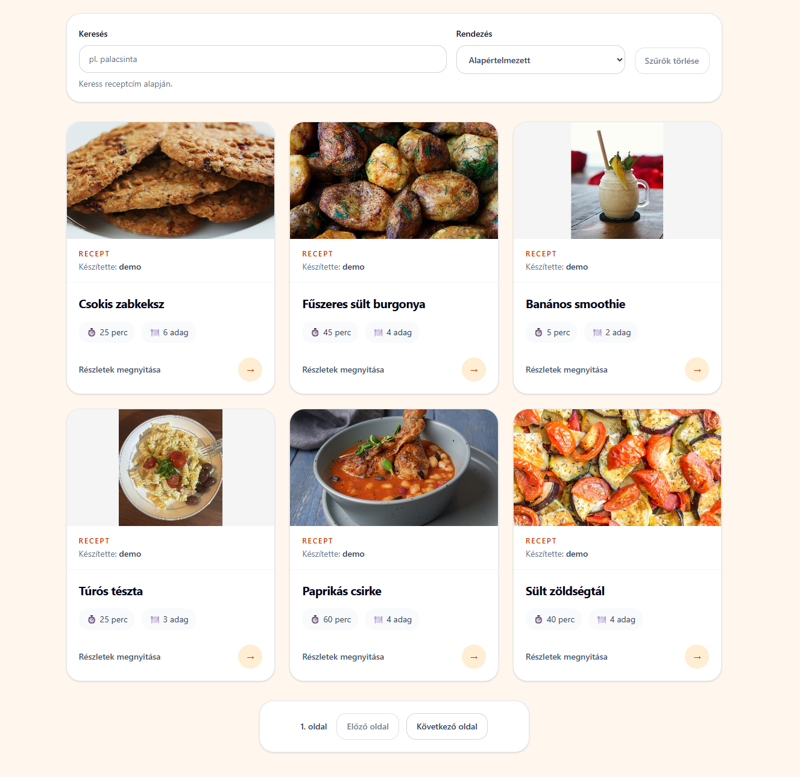
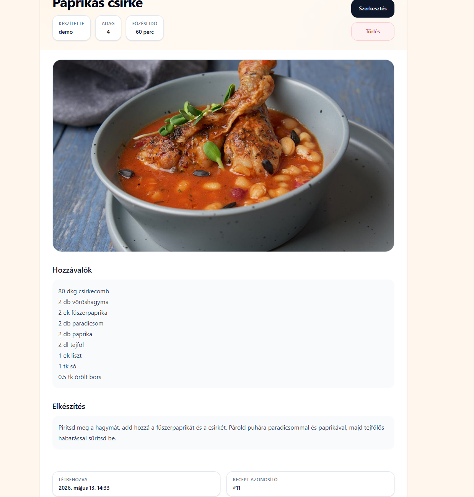
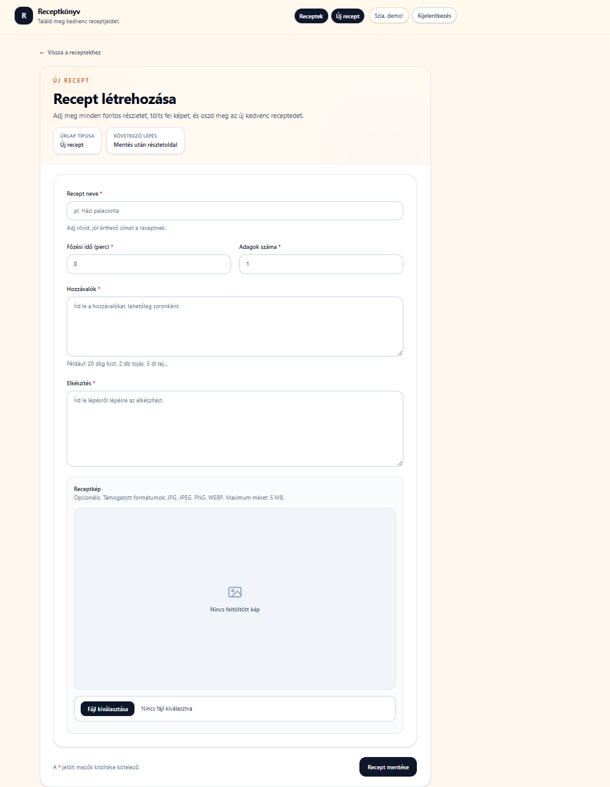
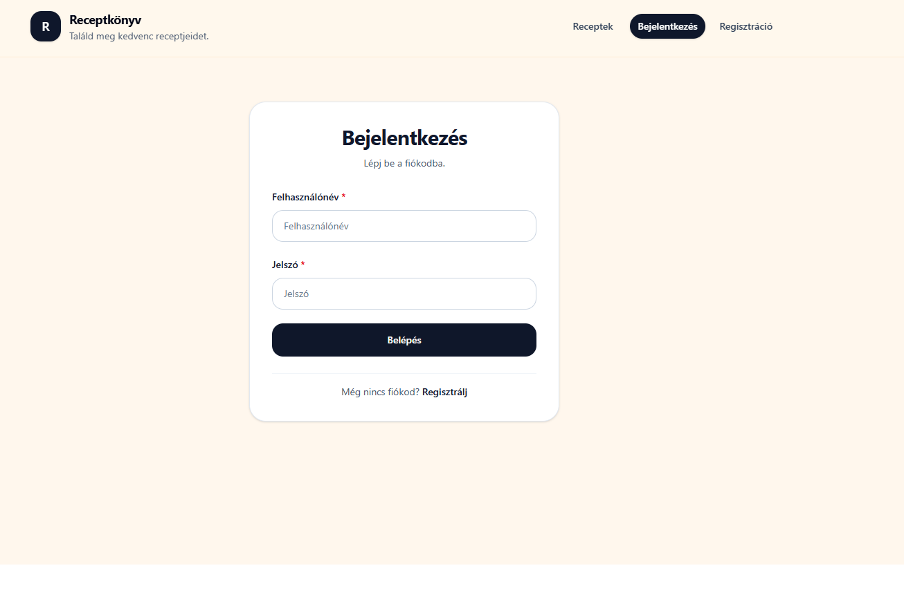

# Recipebook

Modern full-stack recipe management application built with React, Django REST Framework and PostgreSQL.

The goal of this project is not just to demonstrate basic CRUD functionality, but to show a production-minded portfolio project with modern frontend architecture, documented API contracts, automated tests, Docker-based local setup and realistic demo data.

## Live demo

Live demo: Coming soon

The project is currently Docker-ready for local full-stack testing. A hosted portfolio demo is planned as the next deployment step.

## Screenshots

### Recipe list



### Recipe details



### Create recipe form



### Login page



## Feature walkthrough

1. A visitor can open the recipe list and browse the seeded demo recipes.
2. The recipe list supports search, ordering and pagination.
3. Users can register or log in with session-based authentication.
4. Authenticated users can create new recipes with title, ingredients, instructions, cooking time, servings and image upload.
5. Users can edit or delete only their own recipes.
6. Recipe images are uploaded through the Django REST API and displayed in the frontend.
7. The backend exposes OpenAPI documentation through Swagger UI and Redoc.
8. The project can be started locally with Docker Compose and includes seeded demo data.

## Overview

Recipebook allows users to:

- register and log in with session-based authentication,
- browse recipes,
- search, sort and paginate the recipe list,
- create, edit and delete their own recipes,
- upload recipe images,
- view recipe details,
- use a seeded demo environment with 15 sample recipes and images.

The project includes a modernized frontend architecture with React Hook Form, Zod, TanStack Query, reusable UI components and Playwright coverage. The backend provides a Django REST Framework API with OpenAPI documentation and Docker-ready PostgreSQL configuration.

## Tech stack

### Frontend

- React
- TypeScript
- Vite
- React Router
- Tailwind CSS
- React Hook Form
- Zod
- TanStack Query
- Sonner
- Vitest
- React Testing Library
- Playwright

### Backend

- Python
- Django
- Django REST Framework
- PostgreSQL
- Session authentication
- CSRF protection
- drf-spectacular OpenAPI documentation
- Pillow image handling

### Infrastructure and tooling

- Docker
- Docker Compose
- PostgreSQL container
- Nginx frontend container
- GitHub Actions CI
- Mocked and full-stack Playwright E2E tests

## Key features

- Session-based auth flow with CSRF support
- Recipe CRUD with owner-based permissions
- Image upload and image preview
- Search, ordering and pagination
- URL query parameter sync for list filters
- Reusable UI components
- Loading, empty and error states
- Confirm dialog for destructive actions
- Unsaved changes warning for recipe forms
- Toast notifications
- OpenAPI schema, Swagger UI and Redoc
- Docker Compose full-stack local environment
- Demo seed data with 15 recipes and images

## Project structure

```text
backend/
  config/
  recipes/
    management/
    demo_assets/
  requirements.txt
  Dockerfile

frontend/
  src/
    api/
    components/
      layout/
      recipe/
      ui/
    constants/
    forms/
    hooks/
    lib/
    pages/
    schemas/
    styles/
  e2e/
  Dockerfile

docs/
  ci/
  deployment/

docker-compose.yml
```

## Quick start with Docker

The easiest way to run the project is Docker Compose.

Requirements:

- Docker Desktop
- Docker Compose

From the project root:

```bash
docker compose up --build
```

This starts:

| Service  | Description               | URL / Port            |
| -------- | ------------------------- | --------------------- |
| frontend | React app served by Nginx | http://127.0.0.1:5173 |
| backend  | Django REST API           | http://127.0.0.1:8000 |
| db       | PostgreSQL database       | localhost:5432        |

On startup, the backend runs database migrations automatically.

The local Docker setup also seeds demo data when enabled with:

```env
DJANGO_SEED_DEMO_DATA=true
```

The demo seed creates:

- demo user,
- 15 demo recipes,
- demo recipe images.

Demo login:

```text
username: demo
password: demo12345
```

## Docker smoke checklist

After running:

```bash
docker compose up --build
```

open:

```text
http://127.0.0.1:5173
http://127.0.0.1:5173/recipes
http://127.0.0.1:5173/login
http://127.0.0.1:5173/register
http://127.0.0.1:8000/api/docs/
```

Expected result:

- frontend loads,
- recipe list loads with demo recipes,
- login/register pages work,
- API documentation is available,
- recipe create/edit/delete works,
- image upload works.

To stop the stack:

```bash
docker compose down
```

To reset the database and media volumes:

```bash
docker compose down -v
docker compose up --build
```

Warning: `docker compose down -v` removes the PostgreSQL and media volumes.

## Local development without Docker

### Backend

```bash
cd backend
python -m venv .venv
.venv\Scripts\activate
pip install -r requirements-dev.txt
python manage.py migrate
python manage.py runserver
```

Backend URL:

```text
http://127.0.0.1:8000
```

### Frontend

```bash
cd frontend
npm install
npm run dev
```

Frontend URL:

```text
http://127.0.0.1:5173
```

## Demo data

Demo data can be created manually with:

```bash
cd backend
python manage.py seed_demo_data
```

Docker:

```bash
docker compose exec backend python manage.py seed_demo_data
```

The command is idempotent. Running it multiple times does not duplicate the 15 demo recipes.

Demo images are stored as project demo assets:

```text
backend/recipes/demo_assets/images/
```

Image credits are documented here:

```text
backend/recipes/demo_assets/IMAGE_CREDITS.md
```

## API documentation

The backend exposes OpenAPI documentation with drf-spectacular.

When the backend is running:

| URL                               | Description        |
| --------------------------------- | ------------------ |
| http://127.0.0.1:8000/api/schema/ | Raw OpenAPI schema |
| http://127.0.0.1:8000/api/docs/   | Swagger UI         |
| http://127.0.0.1:8000/api/redoc/  | Redoc              |

Validate the schema:

```bash
cd backend
python manage.py spectacular --validate
```

Expected result:

```text
Warnings: 0
Errors: 0
```

## Testing

### Backend

```bash
cd backend
black . --check
ruff check .
python manage.py check
python manage.py test
python manage.py spectacular --validate
```

### Frontend

```bash
cd frontend
npm run lint
npm run test:run
npm run build
```

### Playwright E2E

Mocked frontend E2E:

```bash
cd frontend
npm run test:e2e:mocked
```

Full-stack E2E:

```bash
cd frontend
npm run test:e2e:fullstack
```

The project has separate mocked and full-stack Playwright flows. Mocked tests focus on frontend behavior with controlled API responses. Full-stack tests use the real Django backend.

## CI

GitHub Actions runs quality gates for:

- frontend lint, tests and build,
- backend formatting, linting, checks and tests,
- mocked Playwright E2E,
- full-stack Playwright E2E.

Playwright reports are uploaded as CI artifacts for debugging failed runs.

## Current deployment status

The project is Docker-ready for local full-stack smoke testing.

Live demo deployment is currently in preparation.

Planned deployment direction:

- free or minimal-cost portfolio demo,
- static frontend hosting,
- Django backend web service,
- PostgreSQL database,
- external media storage consideration for uploaded images.

## Portfolio highlights

This project demonstrates:

- modern React form architecture with React Hook Form and Zod,
- server-state management with TanStack Query,
- reusable Tailwind-based UI components,
- Django REST Framework API design,
- session authentication with CSRF support,
- image upload handling,
- search, ordering and pagination,
- OpenAPI documentation,
- Dockerized full-stack local environment,
- seeded demo data,
- automated unit, integration and E2E testing,
- CI-backed development workflow.

## Roadmap

Completed:

- frontend form modernization,
- TanStack Query data layer,
- recipe list search, ordering and pagination,
- UI component cleanup,
- mocked and full-stack Playwright tests,
- OpenAPI documentation,
- Docker Compose full-stack setup,
- demo data seeding.

In progress / next:

- production backend start command,
- deployment provider decision,
- live demo deployment,
- production media storage strategy,
- final deployment documentation.

## Future development ideas

- categories and tags
- user profile page
- favorites
- shopping list page

## License and image credits

Demo recipe images are used only for portfolio/demo purposes.

Image source details are documented in:

```text
backend/recipes/demo_assets/IMAGE_CREDITS.md
```
